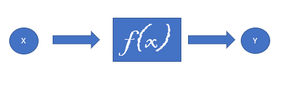
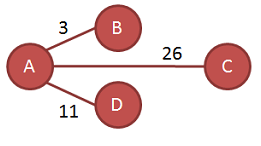
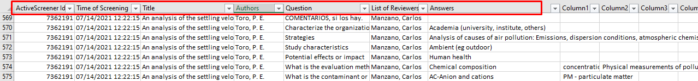
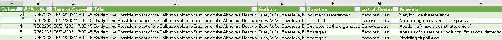

```{r setup, include=FALSE}
knitr::opts_chunk$set(echo = FALSE)
library(sankeydiagram)
```

## R 

 **R** es un lenguaje de programación con un enfoque al análisis estadístico ampliamente utilizado en ciencia de datos. [Descargar](https://cran.dcc.uchile.cl/bin/windows/base/R-4.1.1-win.exe).

**Rstudio** es un entorno de desarrollo integrado(IDE) para R que proporciona servicios integrales para facilitarle al desarrollador o programador el desarrollo de software. [Descargar](https://download1.rstudio.org/desktop/windows/RStudio-1.4.1717.exe)

## Elementos en R

### Variables

Para asignar variables utilizaremos "`<-`"

````{r, echo = TRUE}
x <- 4
class(x)
Etiqueta <- "Hola"
class(Etiqueta)
Logico <- TRUE
class(Logico)

```

## Elementos en R

### Vectores

Es la estructura de dato mas básico en R y se define como un conjunto de elementos asignados a la función `c()`

````{r, echo = TRUE}
v1 <- c(1,2,3,4)
class(v1)

```
R "obliga" a que todos los elementos de una misma estructura sean del mismo tipo de datos, a esta propiedad se le llama **coerción**.

````{r, echo = TRUE}
v2 <- c(1,"Hola",TRUE)
class(v2)

```

logical < numeric < character

## Elementos en R

### Matrices

Las matrices y arrays pueden ser descritas como vectores multidimensionales. Al igual que un vector, únicamente pueden contener datos de un sólo tipo, pero además de largo, tienen más dimensiones.

````{r, echo = TRUE}
a <- matrix(1:12, ncol = 4 , nrow = 3)
class(a)
print(a)
```

## Bucle `for`

Un bucle `for` es la iteración repetitiva de un código un determinado número de veces.
        
        for(i in 1:10){
        #codigo
        }

Ejemplo:

```{r, echo = TRUE}
b = 1
for(j in 1:10){
  b = b * j
}
print(paste("El factorial de 10 es: ", b))

```
Otros bucles comunes son `while` y `do while`

## Condicional

        if(Condicion 1){
        #codigo
        }else if(Condicion 2){
        #codigo
        }else{
        #codigo
        }


## Funciones


        
        mifuncion <- function(argumento1, argumento2, …) { cuerpo resultado }

Ejemplo:

```{r, echo =TRUE}

cv <- function(x){
  y <- sd(x)/mean(x)
  return(y)
}
cv(1:10)

```

## Grafos

Un grafo es una pareja de conjuntos (V, E) donde:

- V ≠ {∅}
- E es un conjunto de pares de elementos de V
- Los elementos de V se llaman vértices
- Los pares de E son no ordenados y se llaman aristas



## Grafos (matriz de adyacencia)

LLamamos matriz de adyacencia de G a la matriz nxn, A ={a<sub>ij</sub>}


```{r}

G <- c(0,3,26,11,3,0,0,0,26,0,0,0,11,0,0,0)
A <- matrix(G, 4, 4)
colnames(A) <- c("A", "B", "C", "D")
row.names(A) <- c("A", "B", "C", "D")
print(A)

```


## Graficando matrices
Un diagrama de sankey trabaja de forma similar a un grafo sobre una matriz.

```{r}
G1 <- c(0,3,26,11,0,0,0,0,0,0,0,0,0,0,0,0)
B <- matrix(G1, 4, 4, byrow = TRUE)
colnames(B) <- c("A", "B", "C", "D")
row.names(B) <- c("A", "B", "C", "D")
print(B)
```

```{r, fig.height= 2.8, echo = TRUE}
sankey(B)
```

## Diseñemos un algoritmo

1. Ordenemos los datos.
2. Diseñemos una matriz.
3. Representemos la funcion.


El package "sankeydiagram" fue diseñado para trabajar con archivos CSV descargados desde la plataforma Swift:

- `CxF()`: Toma respuestas en múltiples columnas y las reordena en una columna única.
- `matrizRelacional()`: Toma el archivo ordenado y genera una matriz según 2 criterios en la columna Questions.
- `sankey()`: Grafica cualquier matriz en un diagrama de Sankey.

**PROBLEMA: CxF Y matrizRelacional son funciones muy específicas y la tabla de entrada requiere un formato especifico**


## Package sankeydiagram(instalación)

El package se puede descargar e instalar desde GitHub escribiendo en la consola de Rstudio:

        install.package("devtools")
        library(devtools)
        

        install_github("franciscoxaxo/sankeydiagram")
        library("sankeydiagram")

Ver en [GitHub](https://github.com/franciscoxaxo/sankeydiagram)

## Tratamiento de tablas

Para comenzar se necesita que los títulos de las 7 primeras columnas sean:

"ï..ActiveScreener.Id", "Time.of.Screening", "Title", "Authors", "Question", "List.of.Reviewers","Answers"



## Tratamiento de tablas

Para cargar la tabla utilizaremos la función `read.csv()`:

        df <- read.csv(rutaDelArchivo, sep = ";", encoding = "UTF-8", na.string = "")

Utilizaremos la función `CxF` para ordenar esta tabla:
  
        CxF(df)

El nuevo archivo lucira más o menos así:



## Tratamiento de tablas

Para cargar la nueva tabla utilizaremos nuevamente la función `read.csv()`:

        df2 <- read.csv(rutaDelArchivo, sep = ";", encoding = "UTF-8")
        
Para transformarlo a matriz escojemos dos criterios de la columna Questions y utilizamos la funcion `matrizRelacional`:

        matriz <- matrizRelacional(df2, criterio1 = ####, criterio2 = ####)
        
Esta matriz puede ser representada utilizando la funcion `sankey`:

        sankey(matriz)
